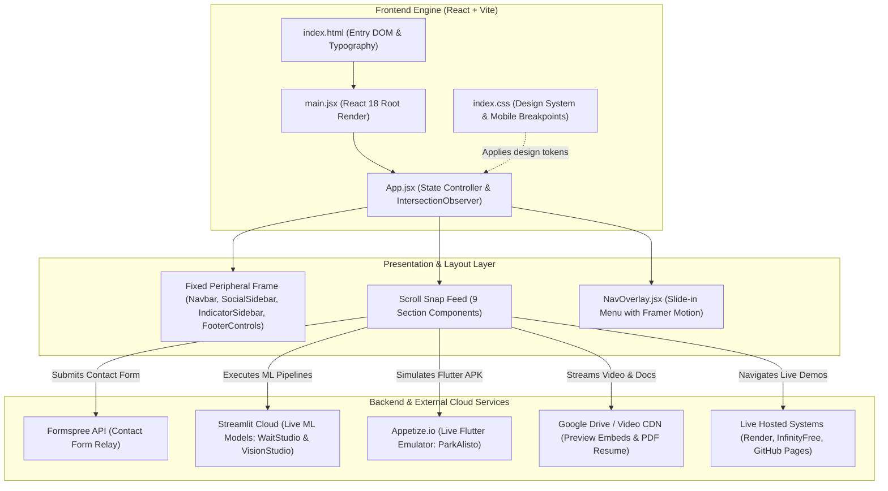

# 🚀 Portfolio Project Knowledge Transfer & Architecture Guide

This document provides a comprehensive technical overview of the **Portfolio** codebase (Paul Cadiz De Leon - Full Stack Developer, Data Scientist & Video Editor). It covers the end-to-end system architecture, backend-to-frontend workflow, styling tokens, component hierarchy, and mobile responsive design.

---

## 1. Executive Summary & Design Concept

* **Identity**: Single-page portfolio presenting full-stack development, machine learning/data science projects, and video editing work.
* **Aesthetic Direction**: High-end cyberpunk/editorial dark mode.
  * **Color Palette**: Pitch dark background (`#080808` / `#0a0a0a`), vibrant neon lime (`#BAFF29` / `#DFF314`), subtle icy cyan/orange accents, and semi-transparent frosted glass cards.
  * **Visual Layering**: Fixed peripheral frame enclosing a scrollable multi-section feed, mouse-driven radial cursor glow, and cinematic grain overlay texture.
  * **Motion & Interactivity**: Directional slide carousels, continuous rotating SVG badges, clip-path reveals, infinite marquees, and responsive touch adaptations.

---

## 2. Tech Stack & Dependencies

| Category | Technology | Purpose |
| :--- | :--- | :--- |
| **Frontend Framework** | **React 18** + **Vite 4** | Component-driven UI and fast HMR bundling. |
| **Animation Engine** | **Framer Motion 10** (`framer-motion`) | Orchestrates scroll reveals, directional carousels, hover effects, and slide-in drawer menus. |
| **Styling** | **Vanilla CSS** (`index.css`) | Modular design system with CSS custom properties (`:root`), glassmorphism, responsive grid, and custom scrollbars. |
| **Form Handling** | **@formspree/react** | Serverless contact inquiry submission and error handling. |
| **Icons & Media** | **Lucide React** + Custom SVGs / PNGs | Vector UI icons, tech stack badges, and project assets. |
| **Container & Scripting** | **Docker** + **VBScript / Batch** | Containerization config (`Dockerfile`) and Windows one-click local launch scripts (`run.bat`, `run_hidden.vbs`). |

---

## 3. End-to-End System Architecture



---

## 4. Codebase Directory Structure

```plaintext
Portfolio/
├── public/                       # Static public assets and favicon
├── page-sections/                # Static assets categorized by section
│   ├── otherassets/              # Screenshots, project previews, MP4 demo files
│   ├── section3-svg/             # SVG icons for Services cards
│   └── section5/                 # Tech stack brand icons (SVG & PNG)
├── src/
│   ├── assets/                   # Profile photos, badge assets, noise texture
│   ├── components/               # React UI & Section Components
│   │   ├── Navbar.jsx            # Top contact strip & availability ticker
│   │   ├── SocialSidebar.jsx     # Left sidebar (social links & menu trigger)
│   │   ├── IndicatorSidebar.jsx  # Right sidebar (section counter & progress rail)
│   │   ├── FooterControls.jsx    # Bottom glass controls (menu toggle & actions)
│   │   ├── NavOverlay.jsx        # Fullscreen slide-in navigation drawer
│   │   ├── HeroSection.jsx       # [Section 1] Greeting, stats, portrait & rotating resume badge
│   │   ├── BioSection.jsx        # [Section 2] Arched frame, experience counters & marquee strip
│   │   ├── Section3Services.jsx  # [Section 3] Glass cards for Full Stack, Data & Video services
│   │   ├── Section4Works.jsx     # [Section 4] Interactive career history timeline
│   │   ├── Section5Skills.jsx    # [Section 5] 15-item technology stack showcase
│   │   ├── Section6Projects.jsx  # [Section 6] Web & System Development Carousel
│   │   ├── Section8DataScience.jsx# [Section 7] Data Science & AI Projects Carousel
│   │   ├── Section7Video.jsx     # [Section 8] Video Editing & Motion Showcase
│   │   └── Section9Contact.jsx   # [Section 9] Multi-step Contact Form (Formspree)
│   ├── App.jsx                   # Main controller, layout grid, mouse glow & observer
│   ├── main.jsx                  # React DOM entry point
│   └── index.css                 # Global CSS design tokens, glassmorphism & responsive rules
├── Dockerfile                    # Containerization build config
├── package.json                  # Dependencies, scripts, and engine versions
├── run.bat / run_hidden.vbs      # Windows one-click local startup scripts
└── vite.config.js                # Vite bundler configuration
```

---

## 5. Program Workflow & State Architecture

### A. The Master Controller (`src/App.jsx`)
1. **Dynamic Cursor Glow**: Listens to `window.mousemove` and computes the CSS `(x, y)` coordinate for a smooth radial glow (`div.cursor-glow`).
2. **Scroll Spy & State Synchronization**:
   * Mounts an `IntersectionObserver` observing all 9 `.section-wrapper` elements with a `0.5` intersection threshold.
   * As the user scrolls, `activeSection` state (`1` through `9`) is updated.
   * `activeSection` is passed down to `IndicatorSidebar.jsx` to dynamically animate the counter (`01 / 09`) and calculate the vertical rail fill:
     $$\text{Progress Height} = \left(\frac{\text{activeSection}}{9}\right) \times 100\%$$
3. **Smooth Scroll Navigation**:
   * `handleNavigate(sectionNum)` queries `[data-section="${sectionNum}"]` and executes `scrollIntoView({ behavior: 'smooth' })`.
   * Triggered from `NavOverlay.jsx`, `FooterControls.jsx`, and in-section CTA buttons.

### B. Carousel Mechanics (`Section6Projects.jsx` & `Section8DataScience.jsx`)
* **Directional Sliding**: Maintains `direction` state (`+1` for next slide, `-1` for prev).
* **Framer Motion `AnimatePresence`**: Elements enter and exit based on directional slide variants (`x: direction > 0 ? 300 : -300`).
* **Media Switcher**: Automatically switches between responsive screenshot mockups and HTML5 `<video>` players with custom play/pause and fullscreen controls.

### C. Serverless Contact Form (`Section9Contact.jsx`)
* Utilizes `@formspree/react` hook `useForm('mnjlebne')`.
* Manages submittal states: `submitting` (loading spinner), `succeeded` (success screen), and field-level validation errors (`<ValidationError />`).

---

## 6. Styling Architecture (`src/index.css`)

### A. Design Tokens (`:root`)
```css
:root {
  --bg-primary: #080808;           /* Deep Charcoal Background */
  --accent-lime: #BAFF29;          /* Cyberpunk Soft Neon Lime */
  --text-main: #FFFFFF;
  --text-dim: rgba(255, 255, 255, 0.45);
  --glass-border: rgba(255, 255, 255, 0.05);
  --glass-bg: rgba(255, 255, 255, 0.02);
  --frost-blur: blur(25px);        /* Frosted Glass Filter */
  --grid-size: 100px;              /* Peripheral Frame Dimensions */
  --font-main: 'Outfit', sans-serif;
  --transition-smooth: cubic-bezier(0.16, 1, 0.3, 1);
}
```

### B. The 3×3 Grid Frame Layout
On desktop viewports, the outer frame is configured as a **3×3 CSS Grid**:
```
┌──────────────┬─────────────────────────────┬──────────────┐
│  (Empty)     │  Navbar.jsx                 │  (Empty)     │
├──────────────┼─────────────────────────────┼──────────────┤
│ SocialSidebar│  Scroll Feed (.scroll-container) │ IndicatorSidebar
├──────────────┼─────────────────────────────┼──────────────┤
│ Footer Left  │  Footer Center              │ Footer Right │
└──────────────┴─────────────────────────────┴──────────────┘
```

---

## 7. Mobile View & Responsive Architecture

The project features a full responsive architecture targeting 3 main breakpoint tiers:
* **Desktop (>1200px)**: 100px peripheral grid frame, custom cursor glow, full 3x3 layout.
* **Tablet (769px–1200px)**: Scaled-down grid frame (80px / 60px), adapted font hierarchies.
* **Mobile (<=768px)**: Complete mobile transformation.

### Key Mobile Adaptations:
1. **Grid Collapse (`grid-template-columns: 0 1fr 0`)**: Left and right sidebars collapse to 0px, dedicating 100% of horizontal viewport width to content.
2. **Scroll Mode Conversion**: Desktop `height: 100vh; overflow: hidden;` transforms into natural mobile touch scrolling (`height: auto; overflow-y: visible;`).
3. **Cursor Glow Optimization**: `@media (max-width: 768px) { .cursor-glow { display: none; } }` disables the GPU filter on touchscreens for battery and rendering efficiency.
4. **Layout Stacking**:
   * Hero & Bio 2-column flex rows stack into centered vertical sequences.
   * Project carousels place media preview on top and details/actions below.
   * Contact info and Formspree inputs stack into a clean single column.
5. **`.mobile-hide` Helper**: Hides secondary navbar contacts on narrow screens to prevent text overflow.

---

## 8. Developer Onboarding & Maintenance Guide

### How to Run Locally
```bash
# 1. Install dependencies
npm install

# 2. Start local development server
npm run dev

# 3. Build optimized production bundle
npm run build

# 4. Preview build locally
npm run preview
```

### Windows Helper Scripts
* `run.bat`: Runs `npm run dev -- --open`.
* `run_hidden.vbs`: Silently runs `run.bat` in the background.

### Routine Maintenance Checklist
* **Adding a Project**: Add an entry to `projects` array in `src/components/Section6Projects.jsx` or `src/components/Section8DataScience.jsx`. Slide pagination and counters will auto-update.
* **Updating Contact Form**: Change the Formspree endpoint ID in `src/components/Section9Contact.jsx` (`useForm('YOUR_FORMSPREE_ID')`).
* **Modifying Sections**: When adding or removing a section in `App.jsx`, update the `totalSections` prop in `<IndicatorSidebar />` and the `menuItems` list in `NavOverlay.jsx`.
